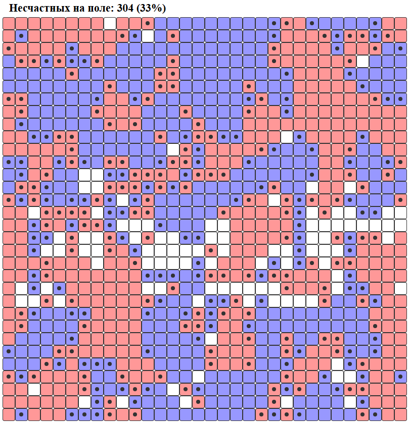

# AIST_Practice_3

В этой практике была построена модель сегрегации Шеллинга.

Модель представляет собой поле, состоящее из ячеек. Поле заполнено агентами двух цветов: красного и синего. 10% ячеек остаётся пустыми.

Каждый агент имеет свойство быть счастливым. Для счастья каждому агенту нужно, чтобы по соседству с ним находилось по крайней мере n = 2 агента того же цвета, что и он сам. В симуляции несчастные агенты обозначаются точкой внутри клетки.

Каждый такт симуляции модель выбирает произвольного несчастного агента и позволяет ему переместиться на любую свободную клетку на поле. Модель не предлагает никакой гарантии того, что на новом месте агент будет счастлив или наоборот. После переезда свойство счастья для агентов пересчитывается.

Симуляция продолжается, пока на поле присутствуют несчастные агенты. Так выглядит конец симуляции при n = 2.

Теория утверждает, что если каждый агент предпочитает иметь в качестве соседей хотя бы треть агентов того же цвета, то возникнет сегрегация. Рассмотрим более высокие значения n.

n = 3. Возникают группы (колонии) агентов одного цвета

<table>
  <tr>
    <td></td>
    <td></td>
    <td></td>
    <td></td>
  </tr>
  <tr>
    <td>17%</td>
    <td>8%</td>
    <td>1%</td>
    <td>0%</td>
  </tr>
</table>

n = 4. Появляется четкое разделение групп агентов разного цвета, колонии предпочитают отделяться пустым пространством

<table>
  <tr>
    <td></td>
    <td></td>
    <td></td>
    <td></td>
  </tr>
  <tr>
    <td>42%</td>
    <td>15%</td>
    <td>10%</td>
    <td>0%</td>
  </tr>
</table>

n = 5 (лучшая итерация). Четко видимые колонии, разделенные пустым пространством

<table>
  <tr>
    <td></td>
    <td></td>
    <td></td>
    <td></td>
  </tr>
  <tr>
    <td>68%</td>
    <td>33%</td>
    <td>17%</td>
    <td>12%</td>
  </tr>
</table>

n = 10 (в качестве соседей рассматривается квадрат 5x5).

<table>
  <tr>
    <td></td>
    <td></td>
    <td></td>
  </tr>
  <tr>
    <td>27%</td>
    <td>8%</td>
    <td>0%</td>
  </tr>
</table>

